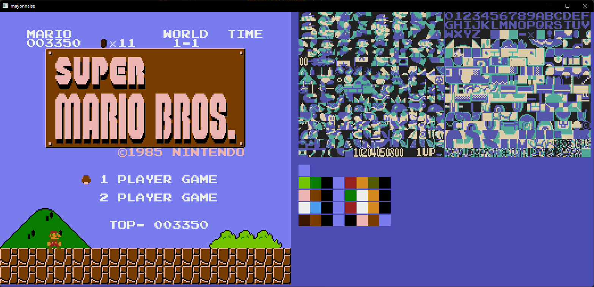

# Simple NES emulator



A simple approach to implement NES emulator on rust. For input/output system it use my own framework [spriter](https://github.com/zvoleg/spriter)

__Implemented:__
- CPU
- PPU (not all functionality)
- Controll
- One mapper for cartridges (000)

__Not implemented:__
- APU
- clock rate (on this moment it implemented by `thread::sleep`)
- some functional of PPU

Build and run emulator (Nes file should be in project directory, and has name 'smb.nes'):
```
cargo run --release
```